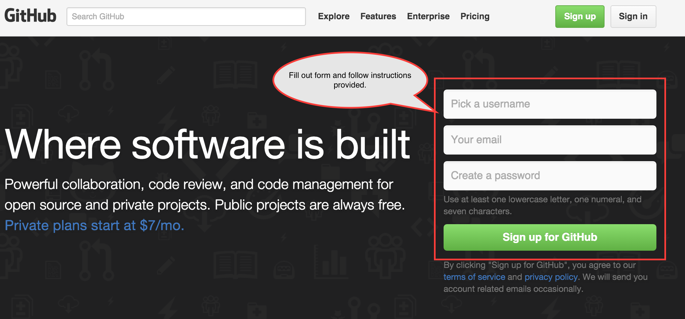
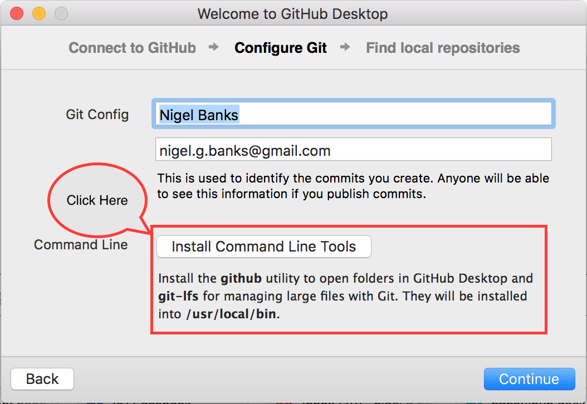
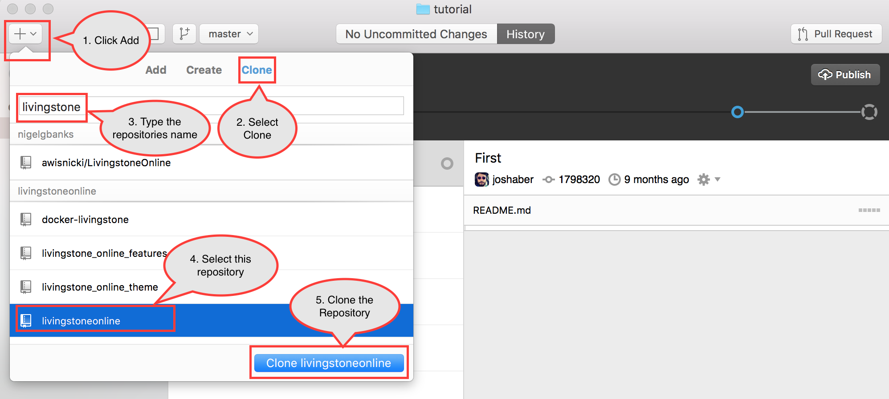
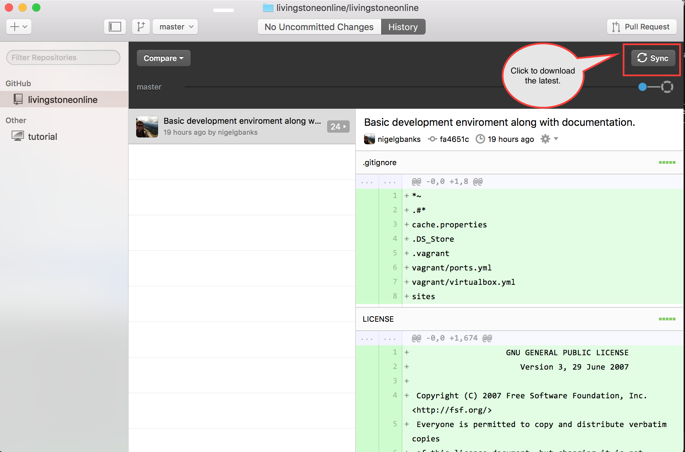
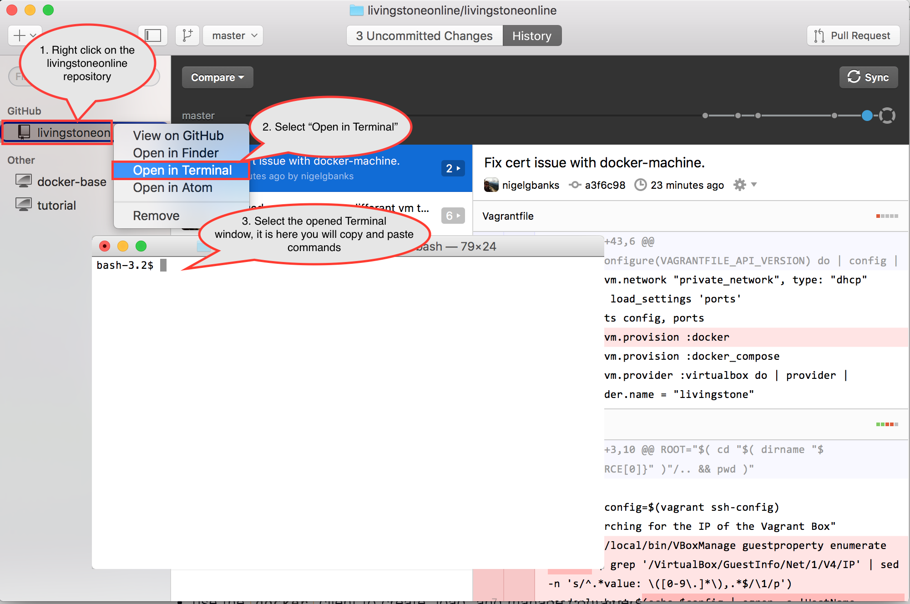

# Local Development Environment

## Table of Contents

* [Introduction](#introduction)
* [Requirements](#requirements)
* [Installation](#installation)
  * [Git and Github](#installation-git-and-github)
  * [Docker and Virtualbox](#installation--docker-and-virtualbox)
  * [Vagrant and Plugins](#installation--vagrant-and-plugins)
  * [Configuring the Environment](#configuring-environment--vagrant-providers-)
* [Launching the Environment](#launching-the-environment)
* [Destroying the Environment](#destroying-the-environment)
* [Starting Docker](#starting-docker)
* [Stopping Docker](#stopping-docker)
* [Updating Docker](#updating-docker)
* [Sharing your Environment](#sharing-your-environment)
* [Reference](#reference)

## Introduction

This is a short guide on how to setup your local development environment on OSX.

## Requirements

* Git
* Vagrant 1.8.1
 * vagrant-triggers plugin
 * vagrant-docker-compose plugin
* Docker 1.9.1
* Virtualbox >= 5.0

## Installation

This covers how to install the development environment on OSX.

### Register for Github Account

Before installing Github Desktop and this projects other dependencies you must
first register for a Github account.

Please visit https://github.com/ and create a new account if you do not already
have one.



### Installation: Github Desktop

Git is a distributed source control system, we use it to track all the system
configuration as well as all the source code used to build
http://livingstoneonline.org. A Git Repository contains all the latest code, but
also a history of every change made to the code, along with comments about the
changes made over time.

Github is a website which hosts Git Repositories, as well as provides a number
of additional features. Such as issue tracking, wiki's and integration into
other services such as Docker Hub.

There many ways to install Git, and many interfaces to use Git. As such more
advanced usage is beyond the scope of this document. For those who are
interested in learning more about Git, I recommend the _free_ e-book
[Pro Git](https://git-scm.com/book/en/v2).

Here we'll only describe how to install the Desktop GUI version of Github for
OSX.

https://desktop.github.com/

Simply download the application provided on the page above, and extract it from
the Zip file (this should be automatic on OSX when you click on the downloaded
file). Then copy the application *Github Desktop.app* to you Applications folder.

Open the application and follow the instructions it provides. Make sure you also
install the command line tools.

**N.B.** If you *do not* have the option to install the command line tools, do
  not worry they are already installed. In such a case please move onto the next
  step.



Once the application is installed you can follow the tutorial it provides if
your interested.

### Download this Repository

Now we need to clone this repository to your computer. Please follow the steps
shown below.

1. Visit the Repository
   [https://github.com/livingstoneonline/livingstoneonline](https://github.com/livingstoneonline/livingstoneonline)
2. Click on the Clone to desktop button shown below.



It will then prompt you to choose a location to clone this repository, feel free
to choose wherever you prefer. The Git repository will be downloaded to your
selected location.

### Update this Repository

You now have a local copy of this repository. As time goes on changes will be
made to this repository, to get the latest changes simply click on the *sync*
button as is shown below.



**You should _sync_ at least once a day.**

**N.B.** If you have already installed Docker and Virtualbox below you **do not** have to 
re-install Github Desktop or Docker Tools or Vagrant to update the enviroment, from
now on just start from [Launching the Environment](#launching-the-environment)

### Installation: Docker and Virtualbox

To install both Docker and Virtualbox on OSX please
download [Docker Toolbox](https://www.docker.com/docker-toolbox) and follow the
[instructions provided](https://docs.docker.com/mac/step_one/).

### Installation: Vagrant & plugins

To install Vagrant, please select the
relevant download for your operating system from the
[downloads page](https://www.vagrantup.com/downloads.html).

Once downloaded run the installer and follow the instructions it provides.

You now have all the dependencies needed to start.

**N.B.** Now that you have all the dependancies intstalled you **do not** have to 
re-install Github Desktop or Docker Tools or Vagrant to update the enviroment, from
now on just start from [Launching the Environment](#launching-the-environment)

## Launching the Environment

Open the Github Desktop application, and
[Update this Repository](#update-this-repository) as before.

Then follow the instructions below to open the terminal.



Once at the terminal copy and paste the following command:

```bash
vagrant up
```

The first time this command is run it may need to install some additional
plugins which are documented below. If this is the case it will print a message
like so:

> Installing the 'vagrant-triggers' plugin. This can take a few minutes...

> Installed the plugin 'vagrant-triggers (0.5.2)'!

> Installing the 'vagrant-docker-compose' plugin. This can take a few minutes...

> Installed the plugin 'vagrant-docker-compose (0.0.9)'!

> Dependencies installed, please try the command again. 

If that is displayed please copy and paste the command again.

```bash
vagrant up
```

This will trigger the download of an VM image, and provision the image using
docker-machine, and docker-compose. This may take upwards of 30 minutes to 2
hours depending on your internet connection. Subsequent calls to this command
will be much faster as the assets will have been downloaded.

**When the process is finished it will stop out-putting text.**

At this point you should have a fully running server, that you can access here:

[http://localhost:8000](http://localhost:8000)

If you are not doing any development and are simply testing the environment your
are done and do not need to proceed to the next step.

**N.B.** You should run ```vagrant up``` once a day. So you have the latest
  development work.

## Updating the Environment

Updating the environment is exactly the same as
[Launching the Environment](#launching-the-environment).

**N.B.** You **do not** have to re-install Github Desktop or Docker Tools or 
  Vagrant to update the enviroment.

## Restarting the Environment

If you shut down your computer, you'll need to restart the environment.
Fortunately this is exactly the same steps as
[Launching the Environment](#launching-the-environment).

**N.B.** You **do not** have to re-install Github Desktop or Docker Tools or 
  Vagrant to update the enviroment.

## Destroying the Environment

Be *very careful* that you actually want to *destroy* the environment, before
executing the command below.

As destroying the environment means you'll have to *re-download absolutely
everything*.

Open the Github Desktop application and then follow the instructions below to
open the terminal.


Once at the terminal copy and paste the following command:

```bash
vagrant destroy
```

If you would like to recreate the environment after destroying it, just follow 
the instructions in the [Launching the Environment](#launching-the-environment)
section again.

**N.B.** You **do not** have to re-install Github Desktop or Docker Tools or 
  Vagrant to update the enviroment.

## Notes for Developers

### Configuring Vagrant

Once you have Vagrant installed, you can now install the required plugins using
the command line. Please open your terminal and enter the following.

```bash
vagrant plugin install vagrant-triggers
vagrant plugin install vagrant-docker-compose
```

If you skip this step they will be installed the first time you attempt to run
_vagrant up_, but you'll have to run the command twice.

### Configuring Environment (Vagrant Providers)

The _Virtualbox_ server's ports, cpu, and memory usage can be configured via two
YAML files. All the configuration files are located in the [vagrant](../vagrant)
folder.

To setup each feature, simply copy the _example.FEATURE.yml_ file to
_FEATURE.yml_.

Like so:

```bash
cp ./vagrant/example.ports.yml ./vagrant/ports.yml
cp ./vagrant/example.virtualbox.yml ./vagrant/virtualbox.yml
```

Once you have done that you can provide your custom settings for each feature,
by editing the newly created files. Although the default settings should suffice
for most users.

The available settings for each feature is described below.

#### ports.yml

Ports mapped from the Virtualbox VM (aka 'guest') to your physical machine (aka
'host').

* `ports`
  * `guest` - The port on the guest to map from.
  * `host` - The port on the guest to map to.

**N.B.** You shouldn't need to change any of the guest ports, and if you do, you
 must also update the relevant ports in the docker-compose.yml file as well.
 Though you'll likely have to change the host port if it conflicts with another
 one of your Virtualbox VM's.

#### virtualbox.yml

Customize the amount of resources you give to the guest VM:

* `box` - The base Virtualbox image to build from.
* `cpus` - The number of virtual CPU's to allocate to the VM.
* `memory` - The number of MB to allocate for RAM.

The defaults should be sufficient for most users. 

### Interacting with Docker

After this you can now export the docker environment into your shell:

```bash
eval $(docker-machine env livingstone)
```

This is required so that Docker and Docker Compose know which machine to
communicate with. You can add this line at the bottom of your shell start-up
script _~/.bashrc_ or _~/.zshrc_, etc, so you don't need to type it ever again.

**N.B.** If you ever start a new terminal / shell you'll have to enter that again.

### Starting Docker

Now that we can communicate with Docker, we can run Docker Compose to download
the Docker Containers and run them in our VM (remember to first follow the
directions in [Interacting with Docker](#interacting-with-docker)):

```bash
docker-compose up
```

This can take a *very long time* depending on your internet speed. As it will be
downloading roughly 2.5 GB of data. Though once this is setup subsequent updates
are speedy.

Once the box is downloaded and setup you can access the site at:

[http://localhost:8000](http://localhost:8000)


### Stopping Docker

When you no longer want to run Docker simply press *Ctrl-C* at the terminal where
you ran the _vagrant up_ command.

Or you can run the stop command:

```bash
docker-compose stop
```

### Updating Docker

To pull down the latest Docker images, run this command:

```bash
docker-compose pull
```

This doesn't automatically deploy the new images, just downloads them.

If you want to run the latest images you must restart the containers:

```bash
docker-compose restart
```

## Sharing your Environment

Since this system is build on top of vagrant, we can also share a public URL to
our local Development box.

You'll first have to setup and account with
[HashiCorp's Atlas](https://atlas.hashicorp.com/) (don't worry it's free).

Follow the instructions here to login:

[Login](https://atlas.hashicorp.com/help/vagrant/shares/create)

And the instructions here to share the URL.

[HTTP SHARING](https://www.vagrantup.com/docs/share/http.html)

## Editing Files

To be able to edit files locally you need to install some additional software.

* unison
* fswatcher

These tools are provided by both [Macports](https://www.macports.org/) and
[Home Brew](http://brew.sh/), so you can use which ever you prefer.

### Brew

```base
brew install unison
brew install fswatch
```

### Macports

```
port install unison
port install fswatcher
```

The basic concept is _unison_ provides bidirectional syncing of files, and
_fswatcher_ watches the file system for changes, triggering _unison_ to sync
between the environment and your physical machine when ever changes occur.

There are two scripts provided with this repository. They don't take any
arguments so you can run them like any other base script.

* sync: Runs the bidirectional sync just once.
* watch: Runs the file system watcher to automatically sync files.

They'll sync the *$DRUPAL_ROOT/sites* folder to *sites* in this directory.


## Reference

* [Vagrant Docs](https://www.vagrantup.com/docs/)
* [Docker Docs](https://docs.docker.com/)
* [Docker Compose](https://docs.docker.com/compose/)
