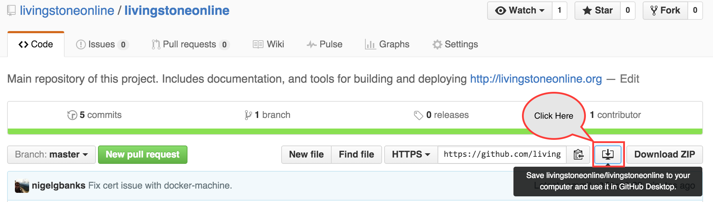

# Local Development Environment

## Table of Contents

* [Introduction](#introduction)
* [Requirements](#requirements)
* [Installation](#installation)
  * [Git and Github](#installation-git-and-github)
  * [Docker and Virtualbox](#installation--docker-and-virtualbox)
  * [Vagrant and Plugins](#installation--vagrant-and-plugins)
  * [Configuring the Environment](#configuring-environment--vagrant-providers-)
* [Launching the Environment](#launching-the-environment)
* [Destroying the Environment](#destroying-the-environment)
* [Starting Docker](#starting-docker)
* [Stopping Docker](#stopping-docker)
* [Updating Docker](#updating-docker)
* [Sharing your Environment](#sharing-your-environment)
* [Reference](#reference)

## Introduction

This is a short guide on how to setup your local development environment on OSX.

## Requirements

* Git
* Vagrant 1.8.1
 * vagrant-triggers plugin
 * vagrant-docker-compose plugin
* Docker 1.9.1
* Virtualbox >= 5.0

## Installation

This covers how to install the development environment on OSX.

### Installation: Git and Github

Git is a distributed source control system, we use it to track all the system
configuration as well as all the source code used to build
http://livingstoneonline.org. A Git Repository contains all the latest code, but
also a history of every change made to the code, along with comments about the
changes made over time.

Github is a website which hosts Git Repositories, as well as provides a number
of additional features. Such as issue tracking, wiki's and integration into
other services such as Docker Hub.

There many ways to install Git, and many interfaces to use Git. As such more
advanced usage is beyond the scope of this document, but for those who are
interested in it I recommend the book [Pro Git](https://git-scm.com/book/en/v2)
which is _free_ and covers Git and it's usage well.

Here we'll only describe how to install the Desktop GUI version of Github for
OSX.

https://desktop.github.com/

Simply download the application provided on the page above, and extract it from
the Zip file (this should be automatic on OSX when you click on the downloaded
file). Then copy the application *Github Desktop.app* to you Applications folder.

Open the application and follow the instructions it provides. Make sure you also
install the command line tools.

**N.B.** If you *do not* have the option to install the command line tools, do
  not worry they are already installed. In such a case please move onto the next
  step.


Once the application is installed you can follow the tutorial it provides if
your interested.

Now clone this repository to your computer, following the steps shown below.



It will then prompt you to choose a location to clone this repository, feel free
to choose wherever you prefer. The Git repository will be downloaded to your
selected location.

You now have a local copy of this repository. As time goes on changes will be
made to this repository, to get the latest changes simply click on the *sync* button as is shown below.


You should *sync* at least once a day.

**N.B.** In all further instructions with the command:

```
cd ~/path/to/project/
```

Indicates you should ```cd``` to the location where you have cloned the
repository above.

### Installation: Docker and Virtualbox

To install both [Docker 1.9.1](https://docs.docker.com/) and
[Virtualbox](https://www.virtualbox.org/wiki/Documentation) on OSX please
download [Docker Toolbox](https://www.docker.com/docker-toolbox) and follow the
[instructions provided](https://docs.docker.com/mac/step_one/).

### Installation: Vagrant & plugins

To install [Vagrant](https://www.vagrantup.com/docs/), please select the
relevant download for your operating system from the
[downloads page](https://www.vagrantup.com/downloads.html).

Once downloaded run the installer and follow the instructions it provides.

Once you have Vagrant installed, you can now install the required plugins using
the command line. Please open your terminal and enter the following.

```bash
vagrant plugin install vagrant-triggers
vagrant plugin install vagrant-docker-compose
```

If you skip this step they will be installed the first time you attempt to run
_vagrant up_, but you'll have to run the command twice.

### Configuring Environment (Vagrant Providers)

Before running the environment on _Virtualbox_ you must first configure it. All
the configuration files are located in the [vagrant](vagrant) folder.

To setup each feature, simply copy the _example.FEATURE.yml_ file to
_FEATURE.yml_. For example with the _Ports_ settings.

```bash
cd ~/path/to/project/
cp ./vagrant/example.ports.yml ./vagrant/ports.yml
```

Once you have done that you can provide your custom settings for each feature,
by editing the newly created file. Although the default settings should suffice
for most users and you should now be able to skip to the next section "Launching
the Environment".

The available settings for each feature is described below.

#### ports.yml

Ports mapped from the Virtualbox VM (aka 'guest') to your physical machine (aka
'host').

* `ports`
  * `guest` - The port on the guest to map from.
  * `host` - The port on the guest to map to.

**N.B.** You shouldn't need to change any of the guest ports, and if you do, you
 must also update the relevant ports in the docker-compose.yml file as well.

#### virtualbox.yml

Customize the amount of resources you give to the guest VM:

* `box` - The base Virtualbox image to build from.
* `cpus` - The number of virtual CPU's to allocate to the VM.
* `memory` - The number of MB to allocate for RAM.

The defaults should be sufficient for most users. 

## Launching the Environment

To run the *Development* environment locally simple open the terminal, and
navigate to the project folder (_in which this repository resides_).

```bash
cd ~/path/to/project/
vagrant up
```

This will trigger the download of an VM image, and provision the image using
docker-machine, and docker-compose. This may take upwards of 30 minutes to 2
hours depending on your internet connection. Subsequent calls to this command
will be much faster as the assets will have been downloaded.

At this point you should have a fully running server, that you can access here:

[http://localhost:8000](http://localhost:8000)

If you wish to update it or if you turned off your computer and the server is
down you can simply run vagrant up again. Like so:

```bash
cd ~/path/to/project/
vagrant up
```

If you are not doing any development and are simply testing the environment your
are done and do not need to proceed to the next step.

**N.B.** You should run ```vagrant up``` once a day. So you have the latest
  development work.

### Interacting with Docker

After this you can now export the docker environment into your shell:

```bash
eval $(docker-machine env livingstone)
```

This is required so that Docker and Docker Compose know which machine to
communicate with. You can add this line at the bottom of your shell start-up
script _~/.bashrc_ or _~/.zshrc_, etc, so you don't need to type it ever again.

**N.B.** If you ever start a new terminal / shell you'll have to enter that again.

## Destroying the Environment

Be *very careful* that you actually want to *destroy* the environment, before
executing the command below.

As destroying the environment means you'll have to *re-download absolutely
everything*.

```bash
cd ~/path/to/project/
vagrant destroy
```

## Starting Docker

Now that we can communicate with Docker, we can run Docker Compose to download
the Docker Containers and run them in our VM (remember to first follow the
directions in [Interacting with Docker](#interacting-with-docker)):

```bash
cd ~/path/to/project/
docker-compose up
```

This can take a *very long time* depending on your internet speed. As it will be
downloading roughly 2.5 GB of data. Though once this is setup subsequent updates
are speedy.

Once the box is downloaded and setup you can access the site at:

[http://localhost:8000](http://localhost:8000)


## Stopping Docker

When you no longer want to run Docker simply press *Ctrl-C* at the terminal where
you ran the _vagrant up_ command.

Or you can run the stop command:

```bash
cd ~/path/to/project/
docker-compose stop
```

## Updating Docker

To pull down the latest Docker images, run this command:

```bash
cd ~/path/to/project/
docker-compose pull
```

This doesn't automatically deploy the new images, just downloads them.

If you want to run the latest images you must restart the containers:

```bash
cd ~/path/to/project/
docker-compose restart
```

## Sharing your Environment

Since this system is build on top of vagrant, we can also share a public URL to
our local Development box.

You'll first have to setup and account with
[HashiCorp's Atlas](https://atlas.hashicorp.com/) (don't worry it's free).

Follow the instructions here to login:

[Login](https://atlas.hashicorp.com/help/vagrant/shares/create)

And the instructions here to share the URL.

[HTTP SHARING](https://www.vagrantup.com/docs/share/http.html)

## Editing Files

To be able to edit files locally you need to install some additional software.

* unison
* fswatcher

These tools are provided by both [Macports](https://www.macports.org/) and
[Home Brew](http://brew.sh/), so you can use which ever you prefer.

### Brew

```base
brew install unison
brew install fswatcher
```

### Macports

```
port install unison
port install fswatcher
```

The basic concept is _unison_ provides bidirectional syncing of files, and
_fswatcher_ watches the file system for changes, triggering _unison_ to sync
between the environment and your physical machine when ever changes occur.

There are two scripts provided with this repository. They don't take any
arguments so you can run them like any other base script.

* sync: Runs the bidirectional sync just once.
* watch: Runs the file system watcher to automatically sync files.

They'll sync the *$DRUPAL_ROOT/sites* folder to *sites* in this directory.


## Reference

* [Vagrant Docs](https://www.vagrantup.com/docs/)
* [Docker Docs](https://docs.docker.com/)
* [Docker Compose](https://docs.docker.com/compose/)
