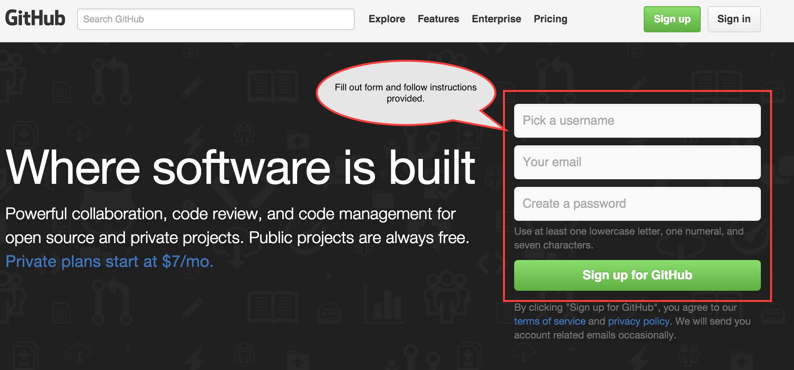
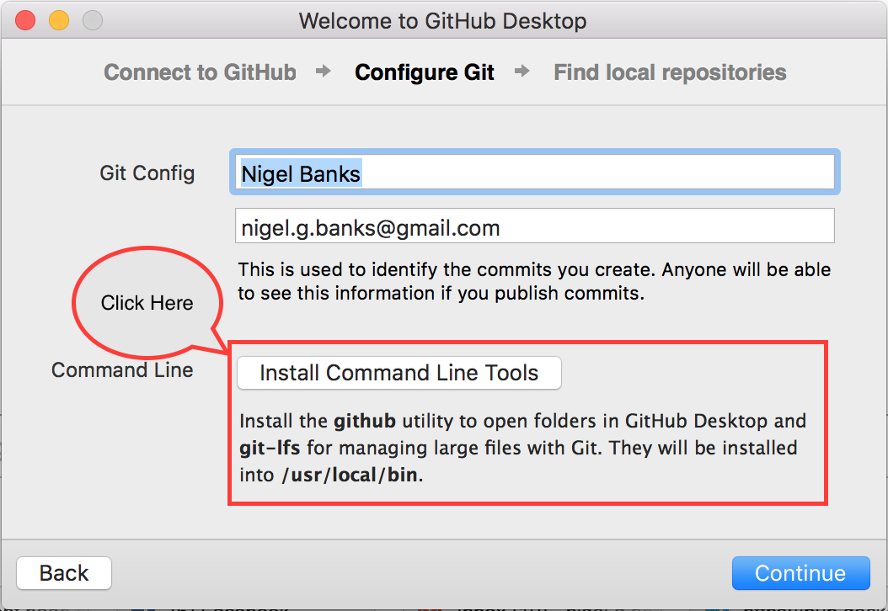
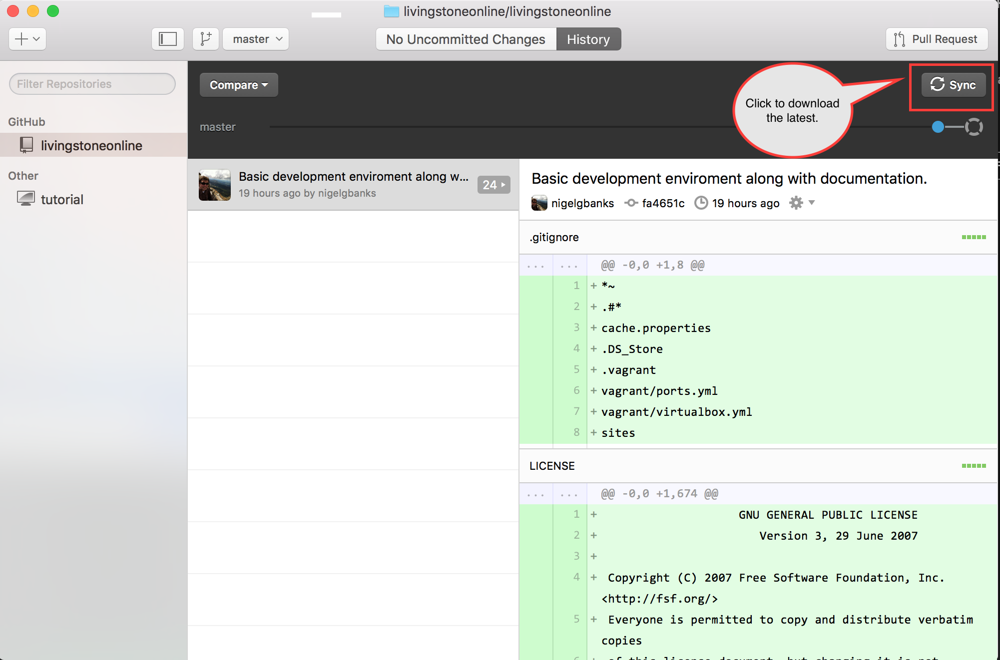

# Installation

## Table of Contents

* [Introduction](#introduction)
* [Requirements](#requirements)
* [Installation](#installation)
  * [Git and GitHub](#installation-git-and-github)
  * [Docker and Virtualbox](#installation--docker-and-virtualbox)
  * [Vagrant and Plugins](#installation--vagrant-and-plugins)
  * [Configuring the Environment](#configuring-environment--vagrant-providers-)
* [Launching the Environment](#launching-the-environment)
* [Destroying the Environment](#destroying-the-environment)
* [Starting Docker](#starting-docker)
* [Stopping Docker](#stopping-docker)
* [Updating Docker](#updating-docker)
* [Sharing your Environment](#sharing-your-environment)
* [Reference](#reference)

## Introduction

This is a short guide on how to setup your local development environment on OSX.

## Requirements

* Git
* Vagrant >= 1.8.1
 * vagrant-managed-servers (_Custom build version included in this repository_)
* Docker >= 1.10.0
* Docker Compose >= 1.6
* Virtualbox >= 5.0

## Register for GitHub Account

Before installing GitHub Desktop and this projects other dependencies you must
first register for a GitHub account.

Please visit https://github.com/ and create a new account if you do not already
have one.



## Installation: GitHub Desktop

Git is a distributed source control system, we use it to track all the system
configuration as well as all the source code used to build
http://livingstoneonline.org. A Git Repository contains all the latest code, but
also a history of every change made to the code, along with comments about the
changes made over time.

GitHub is a website which hosts Git Repositories, as well as provides a number
of additional features. Such as issue tracking, wiki's and integration into
other services such as Docker Hub.

There many ways to install Git, and many interfaces to use Git. As such more
advanced usage is beyond the scope of this document. For those who are
interested in learning more about Git, I recommend the _free_ e-book
[Pro Git](https://git-scm.com/book/en/v2).

Here we'll only describe how to install the Desktop GUI version of GitHub for
OSX.

https://desktop.github.com/

Simply download the application provided on the page above, and extract it from
the Zip file (this should be automatic on OSX when you click on the downloaded
file). Then copy the application *GitHub Desktop.app* to you Applications folder.

Open the application and follow the instructions it provides. Make sure you also
install the command line tools.

**N.B.** If you *do not* have the option to install the command line tools, do
  not worry they are already installed. In such a case please move onto the next
  step.



Once the application is installed you can follow the tutorial it provides if
your interested.

## Download this Repository

Now we need to clone this repository to your computer. Please follow the steps
shown below.

1. Visit the Repository
   [https://github.com/livingstoneonline/livingstoneonline](https://github.com/livingstoneonline/livingstoneonline)
2. Click on the Clone to desktop button shown below.


It will then prompt you to choose a location to clone this repository, feel free
to choose wherever you prefer. The Git repository will be downloaded to your
selected location.

## Setup this Repository

Now that you have this repository downloaded run the setup command:

```bash
./commands/setup
```

To download all the requirements and configure the repository.

## Update this Repository

You now have a local copy of this repository. As time goes on changes will be
made to this repository, to get the latest changes simply click on the *sync*
button as is shown below.



**You should _sync_ at least once a day.**

**N.B.** If you have already installed Docker and Virtualbox below you **do not** have to 
re-install GitHub Desktop or Docker Tools or Vagrant to update the environment, from
now on just start from [Launching the Environment](#launching-the-environment)

## Installation: Docker and Virtualbox

To install both Docker and Virtualbox on OSX please
download [Docker Toolbox](https://www.docker.com/docker-toolbox) and follow the
[instructions provided](https://docs.docker.com/mac/step_one/).

## Installation: Vagrant & plugins

To install Vagrant, please select the
relevant download for your operating system from the
[downloads page](https://www.vagrantup.com/downloads.html).

Once downloaded run the installer and follow the instructions it provides.

You now have all the dependencies needed to start.

## Finished

Now that you have all the dependencies installed you **do not** have to 
re-install GitHub Desktop or Docker Tools or Vagrant to update the environment.
